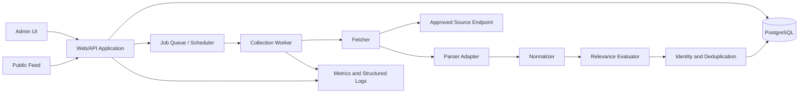
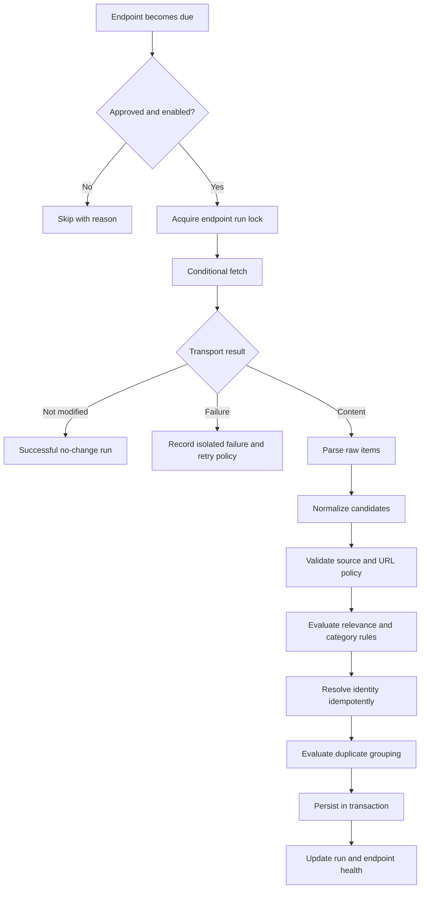

# System Architecture

## 1. Architectural goal

Keep publication-specific configuration at the edges while the core collection and article pipeline remains reusable across topics.

## 2. Logical components



## 3. Process boundaries

The initial deployment may use one repository and one database, but it MUST support at least two independently runnable process roles:

- **Web/API process:** serves public and admin interfaces, validates commands, and reads normalized data.
- **Worker process:** schedules and performs collection, parsing, normalization, relevance evaluation, and persistence.

A process crash or slow source request in the worker must not block normal public-feed requests.

## 4. Module boundaries

Recommended source layout:

```text
src/
  app/
  auth/
  publications/
  sources/
  collection/
    scheduler/
    fetchers/
    parsers/
    normalization/
    relevance/
  articles/
  deduplication/
  public-feed/
  admin/
  jobs/
  database/
  observability/
  shared/
```

Rules:

- Source-specific adapters live behind parser/fetcher interfaces.
- Public-feed code consumes normalized article read models only.
- Admin controllers do not perform collection inline; they enqueue or request jobs.
- Deduplication logic must not depend on publication-specific keywords.
- Publication-specific relevance and categorization enter through configuration interfaces.

## 5. Collection pipeline



## 6. Scheduling model

- Polling is endpoint-specific.
- A scheduler identifies due endpoints and enqueues independent jobs.
- A distributed or database-backed lock prevents overlapping runs for the same endpoint.
- Scheduling uses bounded jitter to avoid synchronized request spikes.
- Manual “check now” respects the same approval, locking, timeout, and rate-limit rules.
- Push-capable sources may enqueue the same normalized pipeline through a separate ingress adapter.

## 7. Persistence and transactions

- Article identity resolution and insertion/updating must occur transactionally.
- Duplicate-group changes must preserve exactly one primary article.
- A failed candidate must not roll back unrelated candidates from the same run unless database integrity requires it.
- Collection-run accounting must distinguish discovered, accepted, updated, skipped, and failed items.
- Database constraints are preferred over application-only assumptions for critical uniqueness rules.

## 8. Initial technical baseline

Unless superseded by an ADR, the MVP baseline is:

- Node.js with TypeScript;
- Express-compatible HTTP application structure;
- PostgreSQL as the system of record;
- a durable scheduler/job mechanism suitable for retries and separate workers;
- server-rendered or lightweight client-rendered web UI;
- container-friendly configuration through environment variables and secrets.

The architecture contract matters more than a specific library choice.

## 9. Scale path

The MVP does not require microservices. It must, however, avoid designs that prevent:

- multiple worker processes;
- per-source concurrency and rate limits;
- read caching for the public feed;
- moving collection execution away from the web host;
- adding another publication without duplicating the application;
- introducing a queue or object storage later.
