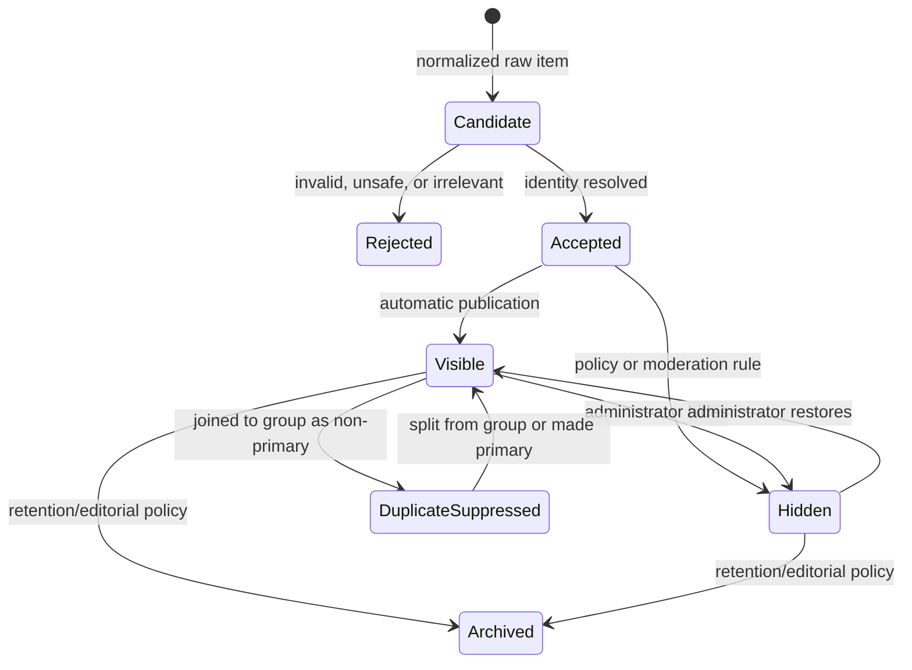

# Article Lifecycle and Deduplication

## 1. Article lifecycle

The exact database representation may use multiple fields, but transitions and reasons must remain auditable.

## 2. Candidate outcomes

Every normalized candidate ends a run with one primary outcome:

- created as a new article;
- matched and updated as an existing article;
- observed unchanged;
- rejected as invalid or unsafe;
- excluded by relevance policy;
- stored but hidden by publication policy;
- attached to a duplicate group;
- failed due to an item-level processing error.

## 3. Article identity versus duplicate identity

These are separate questions:

- **Article identity:** “Have we already stored this source instance?”
- **Duplicate identity:** “Does this separately stored source instance represent the same underlying published item as another stored article?”

Identity checks prevent repeated polling from inserting the same article. Duplicate grouping suppresses multiple stored instances from public display while preserving provenance.

## 4. Identity resolution order

The MVP SHOULD evaluate article identity in this order:

1. Reliable immutable source external identifier within source scope.
2. Canonical URL within publication/source scope.
3. Stable endpoint-specific identity key where explicitly configured.
4. Conservative fingerprint match requiring enough corroborating data.

A fuzzy-title match alone must not overwrite an existing article.

## 5. Duplicate classes

### Exact repeat

The same source item is encountered again. This is article identity, not a new duplicate-group member.

### Alternate URL from the same source

Tracking URLs, print URLs, mobile URLs, or listing aliases resolve to the same article. These SHOULD converge on one article identity when canonicalization is reliable.

### Republished or syndicated identical item

Separate source instances reproduce the same article. These may form one duplicate group while retaining every instance.

### Related coverage

Separate reporting about the same event is not a true duplicate. It remains visible as separate articles.

### Updated or corrected article

A source updates an existing article. The platform updates the stored instance and records change provenance; it does not create a new article unless the source intentionally published a distinct URL/item.

## 6. Automatic duplicate signals

Signals may include:

- exact canonical URL;
- shared reliable external identifier;
- explicit canonical metadata;
- normalized title equality;
- high title similarity within a bounded time window;
- matching author, publication date, and source-provided summary fingerprint;
- known syndication metadata.

Automatic grouping must use deterministic thresholds and reason codes. Weak similarity should create a review candidate rather than silently suppress an article.

## 7. Primary selection

A duplicate group has exactly one primary article.

Default selection SHOULD consider:

1. administrator override;
2. original publisher or canonical metadata;
3. source priority configured by the publication;
4. completeness and URL quality;
5. earliest credible publication time;
6. stable deterministic tie-breaker.

Changing the primary must not change group membership or delete source instances.

## 8. Public-feed behavior

- Only visible primary articles appear as normal feed rows.
- Non-primary duplicate members remain accessible to administrators.
- The MVP may show an optional “also reported by” count, but must not expose confusing duplicate rows.
- Related coverage remains separately visible.
- Hidden articles do not become visible merely because another duplicate member changes state.

## 9. Manual moderation

Administrators MUST be able to:

- merge selected articles into a duplicate group;
- split one or more members from a group;
- choose the primary article;
- hide or restore individual members;
- inspect the automatic matching method and confidence;
- record an audit event for each action.

Manual decisions override automatic grouping until explicitly released or revised.

## 10. False-positive safeguards

The system MUST avoid aggressive suppression when:

- titles are generic or recurring;
- publication times are far apart;
- URLs point to distinct articles;
- one article is analysis and another is an announcement;
- a source uses reused identifiers incorrectly;
- only topic similarity is present.

When uncertain, preserving two visible articles is preferable to hiding distinct reporting.
