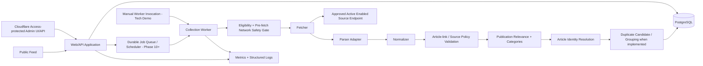
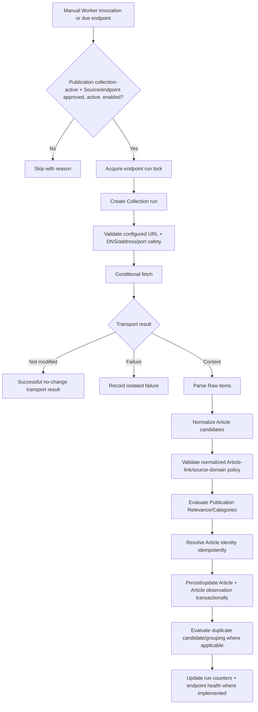

# System Architecture

## Architectural goal

Keep Publication-specific configuration at the edges while the core collection, identity, Article, and duplicate pipeline remains reusable across topics.

## Logical components



## Process boundaries

The initial deployment may use one repository/database, but it MUST support at least two independently runnable process roles:

- **Web/API process:** serves public/admin interfaces, validates commands, reads normalized data, and later requests/enqueues jobs. It does not perform Source collection inline.
- **Worker process:** performs collection execution, eligibility/network-safety checks, parsing, normalization, validation, Relevance, identity resolution, duplicate evaluation where implemented, and persistence.

A slow/crashed Source request in the Worker must not block normal public-feed requests.

During the tech-demo critical path before durable jobs/scheduling exist, collection is invoked manually through the Worker process once transport exists. Phase 10 adds durable scheduling around the same endpoint execution unit; it does not create a second collection path.

### Phase 1 process bootstrap contract

Phase 1 establishes the process/lifecycle boundary without implementing collection or persistence.

- The Web/API process owns the HTTP listener and exposes liveness/readiness endpoints.
- Web/API liveness means the process/server is responsive. Readiness means startup initialization has completed and every critical dependency implemented in the current phase is usable.
- Phase 1 has no PostgreSQL dependency. Phase 2 extends readiness to cover the shared database dependency.
- The Worker is an independently executable process role with a testable bootstrap/startup and clean-shutdown contract.
- Phase 1 does not require a separate Worker HTTP server merely to expose health probes. Worker readiness is proven through startup/configuration/dependency validation until a concrete deployment requirement justifies an HTTP probe.
- Phase 5 adds manual endpoint execution behind this same Worker boundary. Phase 10 adds durable job consumption/scheduling around the same endpoint execution unit rather than creating another Worker path.
- Phase 1 runtime configuration is centralized and typed/validated. Malformed or out-of-range startup configuration must fail predictably; database, Source, Publication-data, scheduler, and collection secrets/configuration are not invented early merely to make validation non-empty.

### Phase 4 execution boundary

Phase 4 introduces the reusable pre-transport gate without introducing transport itself.

- Eligibility reads the persisted Publication/Source/endpoint state and approved-domain policy established in Phase 3.
- A shared cross-process per-endpoint run lock prevents overlapping ownership for one endpoint and is available to every Worker process. PostgreSQL or an equivalently shared coordination mechanism is required; process-local locking alone is insufficient.
- Network safety may resolve DNS and classifies the concrete destination before transport. Eligible results carry validated destination/address information forward so later transport cannot silently make a second unchecked DNS decision.
- Eligible execution stops at an injected/controlled outbound-fetch boundary in Phase 4. No publisher HTTP request, real HTTP redirect following, persisted Collection run, or manual endpoint collection command exists yet.
- Redirect destination revalidation is exposed as a reusable primitive in Phase 4; Phase 5 is the first phase that follows actual HTTP redirects through it.

## Module boundaries

Recommended initial layout:

```text
src/
  app/
  publications/
  sources/
  collection/
    scheduler/       # populated when automated polling arrives
    fetchers/
    parsers/
    normalization/
    relevance/
    safety/
  articles/
  deduplication/
  public-feed/
  admin/
  jobs/              # populated when durable jobs arrive
  database/
  observability/
  shared/
```

Native application authentication/account modules are deferred beyond MVP unless a later decision promotes them.

The layout above is a target ownership map, not a requirement to create empty directories or placeholder modules before substantive code exists.

Phase 1 Publication-awareness is structural only: generic naming, dependency direction, and module placement must preserve Publication as the future topic/configuration scoping boundary. Phase 1 does not implement Publication persistence, Source configuration, bootstrap/seed data, Categories, Relevance rules, or the initial indie-author Publication.

Rules:

- Source-specific retrieval/parsing lives behind fetcher/parser adapter interfaces established with the first RSS/Atom implementation.
- Public-feed code consumes normalized Article read models only.
- Admin controllers do not perform collection inline; once manual check-now exists they invoke/request the Worker collection path and later enqueue the same endpoint execution unit.
- Deduplication logic does not depend on Publication-specific keywords.
- Publication Relevance/Categories enter through configuration interfaces.
- Before configurable Relevance rules exist, the same Relevance boundary runs with an empty rule set and returns the deterministic default `include` decision.
- Article observations preserve endpoint/run provenance independently from Article cardinality.

## Collection pipeline



This is the completed staged pipeline, not a claim that every node exists in Phase 4. Every redirect returns through the pre-request network-safety gate before being followed.

The pipeline grows by phase without inventing outcomes for stages that do not exist yet:

- Phase 4 establishes eligibility, the shared endpoint lock, network-safety decisions, and the controlled outbound-fetch boundary only.
- Phase 5 first adds manual endpoint execution, real HTTP transport/redirect following, minimal persisted Collection runs, and transport/parser status/counts.
- Phase 6 adds normalization status/counts and validated candidates.
- Before configurable Relevance rules exist, candidates pass the empty-rule/default-include Relevance boundary.
- Phase 7 adds Article identity/persistence, observations, and canonical post-identity outcomes.
- Later duplicate phases add duplicate effects/grouping without redefining Article identity.

## Scheduling model

### Tech-demo execution

During Phases 5–9 before durable scheduling exists:

- collection is manually invoked in the Worker for one configured endpoint at a time;
- eligibility, the Phase 4 shared lock, network safety, fetch/redirect, parsing, normalization, Relevance, identity/persistence, and run accounting use the canonical pipeline stages that exist;
- separate endpoint runs fail independently;
- Web/API does not fetch Sources inline.

Phase 4 itself stops at the controlled outbound-fetch boundary and does not yet create endpoint Collection runs.

### Automated polling

From Phase 10 onward:

- polling is endpoint-specific;
- scheduler identifies due approved + active + enabled endpoints under collection-active Publications and enqueues independent jobs;
- jobs reuse the Phase 4 shared/database-backed endpoint lock to prevent overlapping runs for one endpoint;
- bounded jitter avoids synchronized spikes;
- manual `check now` uses the same approval, lifecycle, operational, locking, network-safety, timeout, concurrency, and rate-limit rules and requests the same endpoint execution unit;
- push/webhook adapters are not MVP work; a future push ingress must reuse the normalized downstream pipeline.

## Persistence and transactions

- Git-tracked migrations and migration infrastructure are authoritative for database schema structure and schema evolution.
- Runtime processes do not make ad hoc schema changes; Web/API and Worker startup do not automatically apply migrations.
- The Phase 4 endpoint lock is shared across Worker processes and requires real persistence/concurrency evidence when implemented through PostgreSQL or another shared coordination store.
- Minimal Collection-run persistence begins with real transport in Phase 5; it does not wait for Article persistence.
- Article identity resolution plus Article create/update and the corresponding successful identity-resolving observation form one atomic per-candidate transaction with critical uniqueness constraints.
- `created`, `updated`, and `unchanged` observations reference the resolved Article; pre-identity outcomes such as `rejected` or `excluded` may persist provenance without an Article identifier as governed by the domain contract.
- An Article observation is linked to the actual Source endpoint and existing Collection run that produced the candidate; endpoint/run and Article Publication/Source ownership must remain consistent.
- A failed candidate does not roll back unrelated successful candidates from the same Collection run unless integrity requires it; Phase 7 does not wrap an entire feed batch in one all-or-nothing Article transaction.
- Collection-run finalization occurs after the bounded candidate batch finishes and canonical processing-outcome counters are known.
- Duplicate-group changes preserve exactly one Primary Article.
- Duplicate-review decisions persist independently from groups.
- Once Article persistence exists, Collection-run accounting uses the canonical post-identity outcome taxonomy from the domain contract.
- Database constraints are preferred over application-only assumptions for critical identity/uniqueness rules.

## Administrative perimeter

MVP administrative UI/API routes are protected by Cloudflare Access according to `docs/decisions/cloudflare-access-admin-perimeter.md`.

- Supported deployments prevent direct-origin bypass of the Access perimeter.
- Application-managed accounts/sessions/roles are not part of MVP architecture.
- State-changing admin browser actions still require applicable CSRF/equivalent request-integrity protection.
- Admin commands validate Publication/resource ownership regardless of external access control.

## Initial technical baseline

Unless superseded by an Accepted ADR:

- Node.js with TypeScript;
- Express-compatible HTTP structure;
- PostgreSQL as system of record;
- manual Worker collection during the tech-demo critical path;
- durable scheduler/job mechanism suitable for retries and separate Workers from Phase 10 onward;
- server-rendered or lightweight client-rendered web UI;
- container-friendly environment/secrets configuration.

The architecture contract matters more than a specific library choice.

## Scale path

MVP does not require microservices, but must not prevent:

- multiple Worker processes;
- bounded global/per-host/per-Source concurrency;
- public-feed read caching;
- moving collection execution away from the web host;
- adding Publications without duplicating the application;
- evolving durable jobs/object storage where justified.
