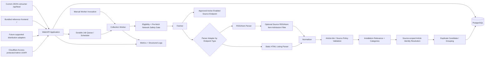

# System Architecture

## Architectural goal

Keep topic-specific Publication configuration at the edges while the core collection, identity, Article, duplicate, scheduling, administration, and **outward distribution semantics** remain reusable across topics and deployments.

News Scraper is a headless aggregation/distribution Platform. The administrator UI/API is its control plane. Supported outward consumers sit above one canonical Article-selection/read boundary rather than owning collection, eligibility, moderation, duplicate suppression, or destination rules themselves.

Each deployed installation hosts exactly one Publication. The reusable unit is the codebase: a different topic is configured and deployed as another installation rather than added as another concurrently hosted Publication.

Publication is singleton editorial configuration, not relational tenancy. Real Source/endpoint/run/Article/observation relationships remain explicit.

## Logical components

The approved distribution architecture has four layers:

1. an isolated instance containing Web/Admin, Worker, PostgreSQL state, scheduler/jobs, configuration/secrets, and distribution interfaces;
2. its instance-owned control plane for Sources/endpoints, collection filters, Categories, Relevance, moderation, duplicates, health/operations, and Distribution Profiles;
3. named Distribution Profiles that narrow canonically eligible Articles; and
4. thin PHP+cron, WordPress, RSS/Atom, and custom-application consumers.



The diagram shows currently implemented surfaces plus the approved future adapter boundary. Exact transport schema/version/path, authentication, CORS, cache mechanics, profile selectors/persistence, SEO/link policy, and analytics remain unresolved.

## Deployment boundary

One instance contains one singleton Publication configuration and its Sources/endpoints/Articles/editorial state. Managed customer instances keep runtime configuration, secrets, persistence, jobs, human access, and machine credentials independently bounded. Several instances MAY share physical infrastructure without sharing customer application/domain state or introducing relational tenancy.

The singleton Publication configuration carries installation-wide news-product settings such as name, `active_for_collection`, `public_status`, branding/presentation, Relevance, Categories, and later distribution settings only when those settings are explicitly governed and implemented.

Publication is not a tenant key:

- Sources, Articles, Categories, Relevance rules, duplicate records, jobs, admin commands, and outward consumers do not need a Publication UUID/slug/foreign key to scope the one installation;
- Source `config_key` is installation-wide;
- Source-endpoint `config_key` remains Source-scoped;
- Article identity remains Source-scoped;
- endpoint/Collection-run and Source/Article/observation relationships remain explicit because they protect real provenance/integrity;
- no supported runtime path selects among Publications.

The current bundled reference page is `GET /`. The current basic JSON outward/feed API is `GET /api/feed`. The `1.0.1` root response is server-rendered while preserving the same canonical public/outward read-model semantics used by the API.

These routes are implemented consumers/interfaces, not the definition of the product. A future supported adapter for an existing client website must consume the same governed Article-selection semantics rather than create another eligibility/query authority.

A second topic uses another configured deployment of the same codebase. The managed instance must map naturally to eventual standalone deployment of the complete stack, with no mandatory central News Scraper service for ordinary operation. This architecture does not choose Docker, Compose, Kubernetes, systemd, installer tooling, or supported operating systems.

Multiple distribution consumers for one Publication do not imply or authorize concurrent multi-Publication tenancy.

Distribution Profiles run after canonical Article eligibility and can only narrow it. Every serializer and thin adapter consumes the same profile/read-model authority; adapters may synchronize, cache, and render but cannot own editorial or selection semantics. The existing `public-feed/` module name remains the current canonical outward/public read implementation and is not renamed speculatively.

## Process boundaries

The initial deployment may use one repository/database, but it MUST support at least two independently runnable process roles:

- **Web/API process:** serves the installation's admin interfaces plus supported outward interfaces/consumers, validates commands/requests, reads normalized data, and may request/enqueue jobs. It does not perform Source collection inline. The bundled reference root and `GET /api/feed` share the same public/outward read boundary; future distribution adapters MUST likewise avoid introducing their own Article eligibility/order/query authority.
- **Worker process:** performs scheduled/manual collection execution, eligibility/network-safety checks, parsing, normalization, validation, Relevance, identity resolution, duplicate evaluation where implemented, and persistence.

A slow/crashed Source request in the Worker must not block normal outward/admin requests.

Operator/Worker entry points select Sources/endpoints directly and MUST NOT require Publication selection merely to choose among topics.

### Process lifecycle contract

- Web/API owns the HTTP listener plus liveness/readiness endpoints. Liveness means the process/server is responsive; readiness means startup initialization is complete and current critical dependencies are usable.
- Worker is independently executable with testable startup, dependency validation, and clean shutdown. It needs no separate HTTP server unless deployment requires one.
- Runtime configuration is centralized, typed, and validated; malformed or out-of-range startup configuration fails predictably.
- Manual checks and durable jobs use the same Worker endpoint-execution unit. Publication-aware naming separates configuration from shared behavior and does not imply relational tenancy.

### Endpoint execution safety boundary

- Eligibility reads singleton Publication collection state plus persisted Source/endpoint approval, lifecycle, operational, and domain policy.
- A shared cross-process per-endpoint lock prevents overlapping ownership; process-local locking alone is insufficient.
- Network safety validates configured destinations and every redirect, including DNS/address/port policy, before transport contact.
- Validated destination/address information crosses the fetch boundary so transport cannot silently make an unchecked second DNS decision.

## Module boundaries

Canonical ownership layout:

```text
src/
  app/
  publication/      # singleton installation/editorial configuration
  sources/
  collection/
    scheduler/       # due-endpoint scheduling and scheduler policy/runtime
    fetchers/
    parsers/
    normalization/
    relevance/
    safety/
  articles/
  deduplication/
  public-feed/       # current canonical outward/public Article read semantics
  admin/
  jobs/              # durable endpoint collection jobs/retry/recovery execution
  database/
  observability/
  shared/
```

The existing `public-feed/` name reflects the implemented `1.0.x` surfaces. The product pivot does not authorize a rename merely for terminology. If the later distribution architecture needs a broader module boundary, that rename/refactor must be justified by the actual adapter design and must preserve one canonical Article-selection authority.

The exact implementation may keep or rename an existing module only when that choice produces the smallest coherent canonical design. It MUST NOT retain plural/selector-oriented APIs solely as a compatibility bridge. Legacy-only source modules, wrappers, types, tests, fixtures, configuration paths, and other artifacts from superseded pre-production architecture MUST be deleted when the canonical implementation no longer has an independent use for them.

Native application authentication/account modules are deferred beyond MVP unless a later decision promotes them. Future consumer authentication is a separate unresolved distribution concern and must not be inferred from this statement.

The layout above is a target ownership map, not a requirement to create empty directories or placeholder modules before substantive code exists.

Rules:

- Source-specific retrieval/parsing lives behind fetcher/parser adapter interfaces established with the first RSS/Atom implementation.
- The optional Source RSS/Atom item admission filter is Source-owned include-only configuration evaluated over existing parsed RSS/Atom Raw-item text before Article-candidate normalization; it is distinct from downstream Relevance.
- A configurable static-HTML parser sits behind that same boundary. Endpoint type selects RSS/Atom or HTML parsing; both produce the same Raw-item contract, HTML bypasses the RSS/Atom-only admission filter, and all stages from normalization onward are shared.
- Source-admin sample preview is a pure bounded parser/profile-validation path over operator-supplied HTML. It has no network, Collection run, endpoint lock, scheduler/health, or Article persistence edge and is not another collector.
- Current public/outward code consumes normalized Article read models only. The server-rendered root page and `GET /api/feed` MUST share the same canonical public/outward application/read-model boundary; rendering and JSON shaping may differ, but eligibility, filtering, ordering, cursor semantics, and Article selection MUST NOT fork into competing query paths.
- A future distribution adapter MUST consume that same governed selection boundary or a deliberately evolved successor boundary. It MUST NOT invent adapter-owned SQL/query composition for Source trust, Article visibility, duplicate suppression, moderation, ordering, or `original_url` destination semantics.
- Collection trust and distribution selection are distinct. A future bounded distribution profile may filter already-governed outward-eligible Articles, but Source approval itself is not consumer membership.
- Admin controllers do not perform collection inline; manual check-now requests the same governed endpoint execution/job path rather than a second collector.
- Deduplication logic does not depend on topic-specific keywords.
- Relevance/Categories enter through singleton Publication configuration interfaces and may use Source scope where defined.
- Before configurable Relevance rules exist, the same Relevance boundary runs with an empty rule set and returns deterministic default `include`.
- Article observations preserve endpoint/run provenance independently from Article cardinality.
- Publication identifiers/slugs are not passed through domain/application layers merely as an installation scope token.

## Maintainability and simplification principles

Architecture quality is judged by clear ownership, preserved invariants, and understandable behavior rather than by minimizing raw line count, file count, module count, or abstraction count.

- Prefer simple explicit ownership and control flow over speculative abstraction.
- Introduce or retain an abstraction only when it represents a real stable boundary, isolates a meaningful dependency, or owns genuinely shared semantic behavior; similar-looking code alone is not sufficient justification.
- A governed business rule SHOULD have one canonical implementation path. Consolidate duplicated semantic behavior when doing so removes competing authorities without creating an overly generic helper.
- Keep orchestration readable: coordinating modules should expose the high-level sequence while stage-specific validation, persistence, network, and transformation behavior remains owned by the narrowest appropriate module.
- Transaction, connection, endpoint-lock, timer, listener, stream, child-process, and other resource ownership MUST be explicit enough that acquisition, release, interruption, retry, and failure behavior can be reasoned about locally.
- Production modules MUST NOT carry helpers or branches whose only purpose is test convenience; test-only support belongs in test infrastructure unless the same boundary is genuinely part of production design.
- Dead code, obsolete compatibility-only code, superseded wrappers, commented-out implementations, and unused dependencies SHOULD be removed rather than retained as informal history. Git and durable documentation provide history.
- Do not add a third-party dependency merely to replace a small, clear, well-tested local behavior unless the dependency materially improves correctness, safety, interoperability, or maintenance.
- Optimize runtime, database, Worker, Web/API, startup, resource behavior, and outward delivery from observed measurements and real bottlenecks rather than speculative caching, concurrency, batching, or complexity.
- Behavior-preserving simplification MUST NOT flatten or weaken genuine Source/endpoint/run/Article/observation, transaction, security, provenance, idempotency, duplicate-integrity, or canonical outward-selection boundaries merely because fewer types/joins/modules would result.

Phase 21 performed the deliberate whole-codebase application of these principles after customer launch. Later feature work inherits them; Phase 21 was not a one-time permission to simplify at the expense of governed behavior.

## Collection pipeline


This is the canonical current pipeline. Every redirect returns through the pre-request network-safety gate before being followed.

Evolution constraints that still matter:

- no stage invents outcomes owned by a later stage;
- the empty-rule/default-include Relevance boundary is never bypassed;
- manual and durable execution share one endpoint unit;
- duplicate processing does not redefine Source-scoped Article identity;
- RSS/Atom and static-HTML adapters share every downstream stage after their explicit admission difference;
- there is no Web/API inline collection or browser-automation collector;
- admin sample preview remains a pure parsing path with no network or persistence.

## Scheduling model

### Manual execution

Manual endpoint checks remain an operator path through the same Worker-owned eligibility, locking, network-safety, fetch/redirect, parsing, normalization, Relevance, identity/persistence, duplicate, run-accounting, and health behavior as scheduled work. Separate endpoint runs fail independently; Web/API does not fetch Sources inline.

### Automated polling

- polling is endpoint-specific within the installation;
- scheduler identifies due approved + active + enabled endpoints when singleton Publication collection is active and enqueues independent jobs;
- jobs reuse the shared/database-backed endpoint lock to prevent overlapping runs for one endpoint;
- bounded jitter avoids synchronized spikes;
- manual `check now` uses the same approval, lifecycle, operational, locking, network-safety, timeout, concurrency, and rate-limit rules and requests the same endpoint execution unit;
- no scheduler/job design chooses among multiple topic Publications in one installation;
- push/webhook adapters are not MVP collection work; any future push ingress must reuse the normalized downstream pipeline.

## Persistence and transactions

- Git-tracked migrations and migration infrastructure are authoritative for the supported database schema.
- Runtime processes do not make ad hoc schema changes; Web/API and Worker startup do not automatically apply migrations.
- Before production upgrade compatibility is established, supported databases are created fresh from the repository's current migration chain and bootstrap/configuration workflow.
- Foundational pre-production schema corrections MUST remove, squash, replace, or consolidate superseded migration steps when doing so yields the smaller canonical migration-from-zero model. The active migration tree is not retained as a historical record of disposable schemas; Git history and documentation serve that purpose.
- Existing development/pre-production databases created by superseded source trees are destroyed/recreated and bootstrapped rather than migrated through compatibility transformations.
- Migration-from-zero MUST deterministically create the complete canonical singleton schema.
- Publication tenancy/scoping is absent; Source/endpoint/run/Article/observation relationships and critical uniqueness remain explicit.
- The endpoint lock is shared across Worker processes and requires real persistence/concurrency evidence when implemented through PostgreSQL or another shared coordination store.
- Collection-run persistence begins with the first real fetch phase and does not wait for Article persistence.
- Article identity resolution plus Article create/update and the corresponding successful identity-resolving observation form one atomic per-candidate transaction with critical uniqueness constraints.
- `created`, `updated`, and `unchanged` observations reference the resolved Article; pre-identity outcomes such as `rejected` or `excluded` may persist provenance without an Article identifier as governed by the domain contract.
- An Article observation is linked to the actual Source endpoint and existing Collection run that produced the candidate; endpoint/run and Article Source relationships must remain consistent.
- A failed candidate does not roll back unrelated successful candidates from the same Collection run unless integrity requires it; Article persistence does not wrap an entire feed batch in one all-or-nothing Article transaction.
- Collection-run finalization occurs after the bounded candidate batch finishes and canonical processing-outcome counters are known.
- Duplicate-group changes preserve exactly one Primary Article.
- Duplicate-review decisions persist independently from groups.
- Once Article persistence exists, Collection-run accounting uses the canonical post-identity outcome taxonomy from the domain contract.
- Database constraints are preferred over application-only assumptions for critical identity/uniqueness rules.

Phase 19 established and validated production backup/restore, deployment/rollback, and schema-upgrade procedures. Accepted Phase 20 established the first supported production schema/data baseline. From that baseline forward, `docs/decisions/production-data-and-schema-compatibility.md` governs upgrades: supported production state is preserved, supported migration history remains upgrade-capable, and clean migration-from-zero continues for new/disposable installations but is not sufficient evidence for production upgrade safety.

## Administrative perimeter

MVP administrative UI/API routes are protected by Cloudflare Access according to `docs/decisions/cloudflare-access-admin-perimeter.md`.

- Supported deployments prevent direct-origin bypass of the Access perimeter.
- Application-managed accounts/sessions/roles are not part of MVP architecture.
- State-changing admin browser actions still require applicable CSRF/equivalent request-integrity protection.
- Admin commands validate real resource relationships and domain invariants regardless of external access control.
- Admin navigation/commands operate on the installation's singleton Publication configuration and resources rather than exposing a multi-Publication topic selector.

Future external-consumer authentication/authorization is not defined by the admin perimeter ADR. It requires a separate distribution-security decision if the selected integration method needs it.

## Initial technical baseline

Unless superseded by an Accepted ADR or later governing roadmap/contract requirement:

- Node.js with TypeScript;
- Express-compatible HTTP structure;
- PostgreSQL as system of record;
- one Publication/topic per deployed installation;
- singleton Publication configuration without relational tenancy;
- `GET /api/feed` as the current public JSON/discovery endpoint using the canonical public/outward read-model semantics;
- root `/` as the bundled reference/standalone frontend, with the successful initial response server-rendered from those same semantics and lightweight JavaScript used only as progressive enhancement;
- manual Worker collection preserved as an operator path through the canonical endpoint execution unit;
- durable scheduler/job mechanism suitable for retries and separate Workers;
- container-friendly environment/secrets configuration.

The architecture contract matters more than a specific library choice. Future distribution transports are intentionally not selected by this baseline.

## Scale path

MVP does not require microservices, but the architecture must not prevent:

- multiple Worker processes for the same installation;
- bounded global/per-host/per-Source concurrency;
- canonical outward-read caching where later justified;
- moving collection execution away from the web host;
- adding supported outward distribution adapters that reuse canonical Article-selection semantics;
- deploying additional topic instances from the same codebase without duplicating or topic-forking engine logic;
- evolving durable jobs/object storage where justified.

Scaling infrastructure across deployments in the future MUST preserve the product boundary that one installation contains one Publication/topic unless a new explicit contract/ADR changes that decision.

A future concurrent multi-Publication requirement is a deliberate architecture/data-model project; multiple outward consumers for one Publication are not such a requirement and MUST NOT reintroduce dormant tenant fields.
