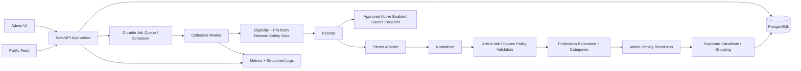
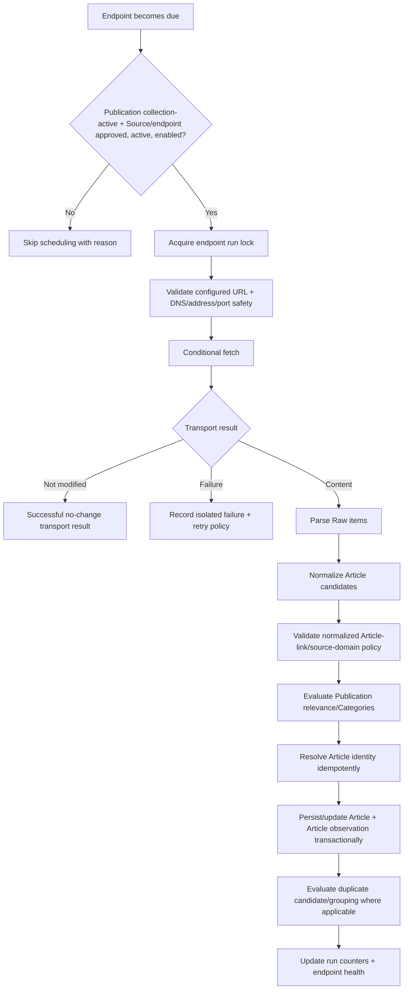

# System Architecture

## Architectural goal

Keep Publication-specific configuration at the edges while the core collection, identity, Article, and duplicate pipeline remains reusable across topics.

## Logical components



## Process boundaries

The initial deployment may use one repository/database, but it MUST support at least two independently runnable process roles:

- **Web/API process:** serves public/admin interfaces, validates commands, reads normalized data, and requests/enqueues jobs.
- **Worker process:** schedules/performs collection, eligibility/network-safety checks, parsing, normalization, validation, relevance, identity resolution, duplicate evaluation, and persistence.

A slow/crashed Source request in the Worker must not block normal public-feed requests.

## Module boundaries

Recommended initial layout:

```text
src/
  app/
  auth/
  publications/
  sources/
  collection/
    scheduler/
    fetchers/
    parsers/
    normalization/
    relevance/
    safety/
  articles/
  deduplication/
  public-feed/
  admin/
  jobs/
  database/
  observability/
  shared/
```

Rules:

- Source-specific retrieval/parsing lives behind fetcher/parser adapter interfaces established with the first RSS/Atom implementation.
- Public-feed code consumes normalized Article read models only.
- Admin controllers do not perform collection inline; they enqueue/request jobs.
- Deduplication logic does not depend on Publication-specific keywords.
- Publication relevance/Categories enter through configuration interfaces.
- Article observations preserve endpoint/run provenance independently from Article cardinality.

## Collection pipeline



Every redirect returns through the pre-request network-safety gate before being followed.

Before Phase 4 Article persistence exists, the Phase 3 Worker stops after normalization/Article-link validation and records only transport/parser/normalization run status/counts. It does not pretend post-identity Article outcomes exist.

## Scheduling model

- Polling is endpoint-specific.
- Scheduler identifies due approved + active + enabled endpoints under collection-active Publications and enqueues independent jobs.
- Distributed/database-backed locking prevents overlapping runs for one endpoint.
- Bounded jitter avoids synchronized spikes.
- Manual `check now` uses the same approval, lifecycle, operational, locking, network-safety, timeout, concurrency, and rate-limit rules.
- Push/webhook adapters are not MVP work; a future push ingress must reuse the normalized downstream pipeline.

## Persistence and transactions

- Article identity resolution and insert/update occur transactionally with critical uniqueness constraints.
- An Article observation is linked to the Collection run as part of successful identity processing.
- Duplicate-group changes preserve exactly one Primary Article.
- Duplicate-review decisions persist independently from groups.
- A failed candidate does not roll back unrelated candidates from the same run unless integrity requires it.
- Once Article persistence exists, Collection-run accounting uses the canonical post-identity outcome taxonomy from the domain contract.
- Database constraints are preferred over application-only assumptions for critical identity/uniqueness rules.

## Initial technical baseline

Unless superseded by an Accepted ADR:

- Node.js with TypeScript;
- Express-compatible HTTP structure;
- PostgreSQL as system of record;
- durable scheduler/job mechanism suitable for retries and separate Workers;
- server-rendered or lightweight client-rendered web UI;
- container-friendly environment/secrets configuration.

The architecture contract matters more than a specific library choice.

## Scale path

MVP does not require microservices, but must not prevent:

- multiple Worker processes;
- bounded global/per-host/per-Source concurrency;
- public-feed read caching;
- moving collection execution away from the web host;
- adding Publications without duplicating the application;
- evolving durable jobs/object storage where justified.
