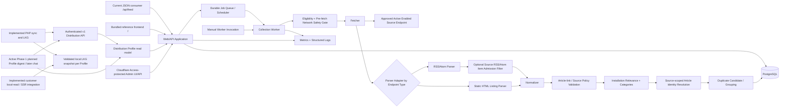
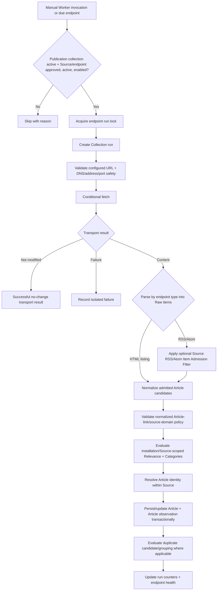

# System Architecture

## Architectural goal

Keep customer/editorial Publication configuration at the edges while the core collection, identity, Article, duplicate, scheduling, administration, **outward distribution semantics**, and AI orchestration remain reusable across subjects and deployments.

News Scraper is a headless aggregation/distribution Platform. The administrator UI/API is its control plane. Supported outward consumers sit above one canonical Article-selection/read boundary rather than owning collection, eligibility, moderation, duplicate suppression, or destination rules themselves.

Each deployed installation hosts exactly one singleton Publication. Under the 2026-08-27 Publication amendment, that Publication represents one customer/editorial property and governed content universe and MAY contain multiple related subject verticals or feed sections. Distribution Profiles are the supported independently configured outward feed/section boundary for those verticals. A separate deployment is used for a distinct Publication/editorial property or intentionally independent operational/security boundary, not merely because two Profiles cover different subjects.

Publication is singleton editorial configuration, not relational tenancy. Real Source/endpoint/run/Article/observation relationships remain explicit. Multiple verticals do not introduce Publication IDs, vertical ownership keys, or Article tenancy.

## Logical components

The implemented distribution architecture has four core layers:

1. an isolated instance containing Web/Admin, Worker, PostgreSQL state, scheduler/jobs, configuration/secrets, and distribution interfaces;
2. its instance-owned control plane for Sources/endpoints, collection filters, Categories, Relevance, moderation, duplicates, health/operations, and Distribution Profiles;
3. named Distribution Profiles that narrow canonically eligible Articles and may represent different customer-facing feeds/verticals; and
4. the generic PHP+cron consumer and custom server applications consuming validated Profile output and local LKG state.

The active 3.0 roadmap adds an optional fifth downstream assistance layer: Phase 1 Profile digest behavior followed later by Profile-grounded chat, governed by `docs/contracts/ai-assistance-contract.md`. AI is not an editorial, eligibility, identity, or persistence authority and cannot become a dependency for ordinary non-AI operation.



The diagram combines current reference surfaces with the implemented 2.0 path and the active-roadmap downstream AI extension. The v1 API, PHP synchronization/LKG, and customer local consumption/server-rendered integration are implemented. The API, Profile, machine-authentication, and cache contracts are governed by the distribution contracts; no Web/API route performs Source collection inline. Phase 1 AI is current roadmap implementation work rather than already-observed runtime behavior, and it must remain downstream of the existing Profile authority.

## Deployment boundary

One instance contains one singleton Publication configuration and its Sources/endpoints/Articles/editorial state. Managed customer instances keep runtime configuration, secrets, persistence, jobs, human access, and machine credentials independently bounded. Several instances MAY share physical infrastructure without sharing customer application/domain state or introducing relational tenancy.

The singleton Publication configuration carries installation-wide customer/editorial settings such as name, `active_for_collection`, `public_status`, branding/presentation, Relevance, Categories, Sources, and distribution settings only when those settings are explicitly governed and implemented. Its Source universe MAY span several subject verticals belonging to the same editorial property.

Publication is not a tenant key:

- Sources, Articles, Categories, Relevance rules, duplicate records, jobs, Profiles, admin commands, and outward consumers do not need a Publication UUID/slug/foreign key to scope the one installation;
- subject verticals/sections do not require a separate vertical ownership field or tenant scope merely to support multiple feeds;
- Source `config_key` is installation-wide;
- Source-endpoint `config_key` remains Source-scoped;
- Article identity remains Source-scoped;
- endpoint/Collection-run and Source/Article/observation relationships remain explicit because they protect real provenance/integrity;
- no supported runtime path selects among Publications.

The current bundled reference page is `GET /`. The current basic JSON outward/feed API is `GET /api/feed`. The `1.0.1` root response is server-rendered while preserving the same canonical public/outward read-model semantics used by the API.

These routes are implemented reference/legacy consumers, not the permanent integration API. The v1 Profile interface consumes the same governed Article-selection semantics without inheriting their `public_status` exposure gate. The reference root does not automatically become a Profile switcher merely because one Publication may contain several verticals.

A distinct customer/editorial Publication or intentionally isolated operational/security domain uses another configured deployment of the same codebase. A difference in subject matter alone no longer requires a second deployment when those subjects belong to the same customer/editorial property and can be represented safely through Profiles.

The complete stack remains self-hostable by design and MUST NOT acquire a mandatory central News Scraper dependency. Packaging that stack as a lightweight Linux VPS/Docker Compose installation remains outside the current committed 3.0 scope unless explicitly promoted. Native/default self-host admin authentication, Kubernetes/multi-node support, and autonomous public self-host production support likewise remain deferred unless later promoted.

Multiple distribution consumers, Profiles, or subject verticals for one Publication do not imply or authorize concurrent multi-Publication tenancy.

Distribution Profiles run after canonical Article eligibility and can only narrow it. `src/distribution/` owns the canonical outward Article authority: its `canonical-outward-articles.ts`, `profile-snapshot.ts`, `profile-page.ts`, `cursor.ts`, `snapshot-revision.ts`, and `profiles/` modules supply the shared eligibility, Profile snapshot/page, continuation, revision, and Profile-configuration boundaries. The `public-feed/` reference consumer reuses this authority while retaining reference-specific `public_status` and public-discovery semantics for `/api/feed` and `/`.

## Process boundaries

The deployment may use one repository/database, but it MUST support at least two independently runnable process roles:

- **Web/API process:** serves the installation's admin interfaces plus supported outward interfaces/consumers, validates commands/requests, reads normalized data, and may request/enqueue jobs. It does not perform Source collection inline. The bundled reference root and `GET /api/feed` share the same public/outward read boundary; distribution and AI interfaces MUST likewise avoid introducing their own Article eligibility/order/query authority.
- **Worker process:** performs scheduled/manual collection execution, eligibility/network-safety checks, parsing, normalization, validation, Relevance, identity resolution, duplicate evaluation where implemented, and persistence.

A slow/crashed Source request in the Worker must not block normal outward/admin requests.

Operator/Worker entry points select Sources/endpoints directly and MUST NOT require Publication selection merely to distinguish subject verticals. Profile selection belongs to outward distribution/AI consumption, not Worker collection routing.

### Process lifecycle contract

- Web/API owns the HTTP listener plus liveness/readiness endpoints. Liveness means the process/server is responsive; readiness means startup initialization is complete and current critical dependencies are usable.
- Worker is independently executable with testable startup, dependency validation, and clean shutdown. It needs no separate HTTP server unless deployment requires one.
- Runtime configuration is centralized, typed, and validated; malformed or out-of-range startup configuration fails predictably.
- Manual checks and durable jobs use the same Worker endpoint-execution unit. Publication-aware naming separates configuration from shared behavior and does not imply relational tenancy.

### Endpoint execution safety boundary

- Eligibility reads singleton Publication collection state plus persisted Source/endpoint approval, lifecycle, operational, and domain policy.
- A shared cross-process per-endpoint lock prevents overlapping ownership; process-local locking alone is insufficient.
- Network safety validates configured destinations and every redirect, including DNS/address/port policy, before transport contact.
- Validated destination/address information crosses the fetch boundary so transport cannot silently make an unchecked second DNS decision.

## Module boundaries

Canonical ownership layout:

```text
src/
  app/
  publication/      # singleton installation/customer-editorial configuration
  sources/
  collection/
    scheduler/       # due-endpoint scheduling and scheduler policy/runtime
    fetchers/
    parsers/
    normalization/
    relevance/
    safety/
  articles/
  deduplication/
  distribution/      # canonical outward Article, Profile snapshot/page, cursor, revision, and machine-authentication authority
    profiles/        # Profile configuration/persistence and Source-validity coordination
    credentials/     # token/verifier, persistence/authentication, request guard/rate limiting, and credential policy
  public-feed/       # reference-specific public_status/discovery semantics for /api/feed and /
  admin/
  jobs/              # durable endpoint collection jobs/retry/recovery execution
  database/
  observability/
  shared/
```

The Phase 1 AI module location is implementation-planning work. Regardless of path, it MUST consume the canonical Profile/read-model boundary rather than query Article/Profile persistence with competing semantics. Provider-specific Gemini transport must remain behind a narrow server-side boundary. Digest evaluation/orchestration owns only the bounded downstream AI input/state transitions governed by the AI contract; it does not become another canonical Profile selector.

`src/distribution/profiles/` owns Profile configuration/persistence and transactional coordination of Profile/Source usability-reducing mutations; lifecycle/application validation remains the administration/application authority. It does not duplicate Source collection, Articles, identity, or provenance. Later consumers must not query Profile child tables or invent lifecycle/relationship semantics independently. The implemented canonical read model is the required path from canonical outward Article authority to both the public-feed/reference consumer and the Distribution Profile snapshot/page consumer. Later API/AI/controllers must remain thin and must not recreate Article eligibility SQL, Profile filters, Category semantics, ordering, continuation semantics, or snapshot-revision semantics.

`src/distribution/credentials/` owns token generation/parsing and verifier derivation, credential persistence/authentication lookup, machine authentication, request guarding with bounded process-local rate limiting, and credential configuration/policy. The implemented Web/API distribution runtime/router consumes this boundary and the Profile page/snapshot/cursor/revision producer. It owns the thin permanent v1 HTTP transport, status/schema/header/conditional/telemetry/HTTPS/trust boundary and does not recreate credential/token SQL, verifier derivation, lifecycle interpretation, machine authorization semantics, authenticated-quota/invalid-auth limiter state, or Article/Profile query semantics.

`integrations/php/` owns the implemented downstream client/synchronization/LKG/local-read/presentation boundary. Ordinary customer code consumes `LocalProfileReader` / `LocalReadResult`; `FilesystemProfileStateStore::readForPhase6()` / `LocalProfileRead` are internal validated state-store handoff details, not a new external integration authority. Multiple synchronized Profiles must retain independent state/locks/usability. Phase 1 digest propagation must extend the normalized supported local-read surface rather than require customer cache parsing, while Phase 2 owns the later package/presentation hardening and real customer package refresh.

The exact implementation may keep or rename an existing module only when that choice produces the smallest coherent canonical design. It MUST NOT retain plural/selector-oriented APIs solely as a compatibility bridge. Legacy-only source modules, wrappers, types, tests, fixtures, configuration paths, and other artifacts from superseded pre-production architecture MUST be deleted when the canonical implementation no longer has an independent use for them, subject to supported production compatibility requirements.

Native/default self-host administrator authentication remains deferred. Dedicated local bearer credentials with `distribution:read` protect the v1 machine API and never grant administrator authority; their lifecycle is governed by `distribution-api-contract.md`. The 3.0 AI contract explicitly forbids silently converting `distribution:read` into unlimited billable interactive AI authority; roadmap Phase 3 owns that later capability/rate/cost boundary.

The layout above is a target ownership map, not a requirement to create empty directories or placeholder modules before substantive code exists.

Rules:

- Source-specific retrieval/parsing lives behind fetcher/parser adapter interfaces established with the first RSS/Atom implementation.
- The optional Source RSS/Atom item admission filter is Source-owned include-only configuration evaluated over existing parsed RSS/Atom Raw-item text before Article-candidate normalization; it is distinct from downstream Relevance and from Distribution Profile filtering.
- A configurable static-HTML parser sits behind that same boundary. Endpoint type selects RSS/Atom or HTML parsing; both produce the same Raw-item contract, HTML bypasses the RSS/Atom-only admission filter, and all stages from normalization onward are shared.
- Source-admin sample preview is a pure bounded parser/profile-validation path over operator-supplied HTML. It has no network, Collection run, endpoint lock, scheduler/health, or Article persistence edge and is not another collector.
- Current public/outward code consumes normalized Article read models only. The server-rendered root page and `GET /api/feed` MUST share the same canonical public/outward application/read-model boundary; rendering and JSON shaping may differ, but eligibility, filtering, ordering, cursor semantics, and Article selection MUST NOT fork into competing query paths.
- The implemented distribution read model consumes the same governed canonical eligibility authority and then applies Profile selection. It MUST NOT invent adapter/API/AI-owned SQL for Source trust, Article visibility, duplicate suppression, moderation, ordering, or `original_url` destination semantics.
- Profile activation/reactivation, association removal, Source unapproval, and Source archival share transactional ownership for the active-Profile usable-Source invariant. Their concurrency coordination must use a consistent lock order; Source operational state remains a collection control, not a Profile-usability condition.
- Collection trust and distribution selection are distinct. Distribution Profiles filter already-governed outward-eligible Articles; Source approval itself is not consumer membership.
- Different subject verticals are represented through configuration and Profiles, not branches in collector/dedupe/eligibility code or vertical ownership fields on Articles.
- Phase 1/later AI consumes only bounded safe normalized Profile context. Source/user/model/retrieved-page text is untrusted; AI cannot mutate or redefine canonical editorial/identity semantics.
- Admin controllers do not perform collection inline; manual check-now requests the same governed endpoint execution/job path rather than a second collector.
- Deduplication logic does not depend on topic-specific keywords.
- Relevance/Categories enter through singleton Publication configuration interfaces and may use Source scope where defined.
- Article observations preserve endpoint/run provenance independently from Article cardinality.
- Publication identifiers/slugs are not passed through domain/application layers merely as an installation scope token.

## Maintainability and simplification principles

Architecture quality is judged by clear ownership, preserved invariants, and understandable behavior rather than by minimizing raw line count, file count, module count, or abstraction count.

- Prefer simple explicit ownership and control flow over speculative abstraction.
- Introduce or retain an abstraction only when it represents a real stable boundary, isolates a meaningful dependency, or owns genuinely shared semantic behavior; similar-looking code alone is not sufficient justification.
- A governed business rule SHOULD have one canonical implementation path. Consolidate duplicated semantic behavior when doing so removes competing authorities without creating an overly generic helper.
- Keep orchestration readable: coordinating modules should expose the high-level sequence while stage-specific validation, persistence, network, transformation, and AI-provider behavior remains owned by the narrowest appropriate module.
- Transaction, connection, endpoint-lock, timer, listener, stream, child-process, provider-request, and other resource ownership MUST be explicit enough that acquisition, release, interruption, retry, and failure behavior can be reasoned about locally.
- Production modules MUST NOT carry helpers or branches whose only purpose is test convenience; test-only support belongs in test infrastructure unless the same boundary is genuinely part of production design.
- Dead code, obsolete compatibility-only code, superseded wrappers, commented-out implementations, and unused dependencies SHOULD be removed rather than retained as informal history. Git and durable documentation provide history.
- Do not add a third-party dependency merely to replace a small, clear, well-tested local behavior unless the dependency materially improves correctness, safety, interoperability, or maintenance.
- Optimize runtime, database, Worker, Web/API, startup, resource behavior, AI cost/context, and outward delivery from observed measurements and real bottlenecks rather than speculative caching, concurrency, batching, vector infrastructure, or complexity.
- Behavior-preserving simplification MUST NOT flatten or weaken genuine Source/endpoint/run/Article/observation, transaction, security, provenance, idempotency, duplicate-integrity, or canonical outward-selection boundaries merely because fewer types/joins/modules would result.

Phase 21 performed the deliberate whole-codebase application of these principles after customer launch. Later feature work inherits them; Phase 21 was not a one-time permission to simplify at the expense of governed behavior.

## Collection pipeline



This is the canonical current collection pipeline. Every redirect returns through the pre-request network-safety gate before being followed. Profile selection and AI assistance occur after persistence/canonical outward eligibility; neither changes this collection pipeline.

Evolution constraints that still matter:

- no stage invents outcomes owned by a later stage;
- manual and durable execution share one endpoint unit;
- duplicate processing does not redefine Source-scoped Article identity;
- RSS/Atom and static-HTML adapters share every downstream stage after their explicit admission difference;
- there is no Web/API inline collection or browser-automation collector;
- admin sample preview remains a pure parsing path with no network or persistence.

## Scheduling model

### Manual execution

Manual endpoint checks remain an operator path through the same Worker-owned eligibility, locking, network-safety, fetch/redirect, parsing, normalization, Relevance, identity/persistence, duplicate, run-accounting, and health behavior as scheduled work. Separate endpoint runs fail independently; Web/API does not fetch Sources inline.

### Automated polling

- polling is endpoint-specific within the installation;
- scheduler identifies due approved + active + enabled endpoints when singleton Publication collection is active and enqueues independent jobs;
- jobs reuse the shared/database-backed endpoint lock to prevent overlapping runs for one endpoint;
- bounded jitter avoids synchronized spikes;
- manual `check now` uses the same approval, lifecycle, operational, locking, network-safety, timeout, concurrency, and rate-limit rules and requests the same endpoint execution unit;
- no scheduler/job design chooses among multiple Publications in one installation; subject verticals do not change collection routing;
- push/webhook adapters require a later explicit contract and must reuse the normalized downstream pipeline.

Phase 1 Gemini digest scheduling is a separate downstream Profile-owned job concern governed by the AI contract. It evaluates enabled Profile digests twice daily, may skip Gemini for unchanged governed input, and MUST NOT run synchronously in ordinary customer page rendering or be conflated with Source collection polling.

## Persistence and transactions

- Git-tracked migrations and migration infrastructure are authoritative for the supported database schema.
- Runtime processes do not make ad hoc schema changes; Web/API and Worker startup do not automatically apply migrations.
- Migration-from-zero MUST deterministically create the complete canonical singleton schema for new/disposable installations.
- Publication tenancy/scoping is absent; Source/endpoint/run/Article/observation relationships and critical uniqueness remain explicit.
- Multiple subject verticals/Profiles do not authorize vertical tenant columns or Article ownership changes.
- The endpoint lock is shared across Worker processes and requires real persistence/concurrency evidence when implemented through PostgreSQL or another shared coordination store.
- Collection-run persistence begins with the first real fetch phase and does not wait for Article persistence.
- Article identity resolution plus Article create/update and the corresponding successful identity-resolving observation form one atomic per-candidate transaction with critical uniqueness constraints.
- `created`, `updated`, and `unchanged` observations reference the resolved Article; pre-identity outcomes such as `rejected` or `excluded` may persist provenance without an Article identifier as governed by the domain contract.
- An Article observation is linked to the actual Source endpoint and existing Collection run that produced the candidate; endpoint/run and Article Source relationships must remain consistent.
- A failed candidate does not roll back unrelated successful candidates from the same Collection run unless integrity requires it; Article persistence does not wrap an entire feed batch in one all-or-nothing Article transaction.
- Collection-run finalization occurs after the bounded candidate batch finishes and canonical processing-outcome counters are known.
- Duplicate-group changes preserve exactly one Primary Article.
- Duplicate-review decisions persist independently from groups.
- Database constraints are preferred over application-only assumptions for critical identity/uniqueness rules.

Any persisted AI digest/auth/integration state introduced by 3.0 must be additive and production-safe, preserve existing customer data, and avoid turning AI output into Source Article metadata. Phase 1 digest persistence follows the AI contract's immutable-successful-generation plus separate active-reference/attempt-state lifecycle; activation must be coherent enough that consumers never observe a partially written structured result.

Phase 19 established and validated production backup/restore, deployment/rollback, and schema-upgrade procedures. Accepted Phase 20 established the first supported production schema/data baseline. From that baseline forward, `docs/decisions/production-data-and-schema-compatibility.md` governs upgrades: supported production state is preserved, supported migration history remains upgrade-capable, and clean migration-from-zero continues for new/disposable installations but is not sufficient evidence for production upgrade safety.

## Administrative perimeter

Managed administrative UI/API routes are protected by Cloudflare Access according to `docs/decisions/cloudflare-access-admin-perimeter.md`.

- Supported managed deployments prevent direct-origin bypass of the Access perimeter.
- Native application accounts/sessions/roles remain deferred unless later promoted.
- State-changing admin browser actions still require applicable CSRF/equivalent request-integrity protection.
- Admin commands validate real resource relationships and domain invariants regardless of external access control.
- Admin navigation/commands operate on the installation's singleton Publication configuration and resources rather than exposing a multi-Publication selector.
- Profile administration is the supported way to configure multiple outward feeds/verticals within that singleton Publication.
- Phase 1 adds protected Profile AI digest configuration/status/manual-generation controls without placing Gemini credentials in Profile configuration.

Machine distribution authentication is a separate boundary governed by `docs/contracts/distribution-api-contract.md`; `distribution:read` credentials never grant administrator authority. Roadmap Phase 3 interactive AI authority is another separately governed billable/abuse-sensitive boundary and must not be inferred from administrator or distribution credentials without explicit implementation.

## Initial technical baseline

Unless superseded by an Accepted ADR or later governing roadmap/contract requirement:

- Node.js with TypeScript;
- Express-compatible HTTP structure;
- PostgreSQL as system of record;
- one singleton Publication/editorial property per deployed installation, potentially containing multiple related subject verticals through Profiles;
- singleton Publication configuration without relational tenancy;
- `GET /api/feed` as the legacy/reference JSON/discovery endpoint using canonical outward semantics;
- root `/` as the bundled reference/standalone frontend, server-rendered from those same semantics with JavaScript only as progressive enhancement;
- authenticated `GET /api/v1/distribution/{profile_key}` as the implemented permanent machine interface;
- generic PHP complete-snapshot synchronization, per-Profile LKG, and normalized local-read customer integration as the implemented downstream baseline;
- manual Worker collection preserved as an operator path through the canonical endpoint execution unit;
- durable scheduler/job mechanism suitable for retries and separate Workers;
- environment/secrets configuration compatible with managed operation and later self-host packaging;
- optional Gemini AI through server-side Profile-grounded behavior, with Phase 1 digest implementation currently active roadmap work and later chat separately phased.

The architecture contract matters more than a specific library choice.

## Scale path

The current architecture does not require microservices, but it must not prevent:

- multiple Worker processes for the same installation;
- bounded global/per-host/per-Source concurrency;
- canonical outward-read caching where justified;
- moving collection execution away from the web host;
- adding supported outward distribution adapters that reuse canonical Article-selection semantics;
- adding materially different Profile feeds/verticals within one customer Publication without duplicating or topic-forking engine logic;
- deploying a distinct customer/editorial Publication as another independently bounded instance of the same codebase;
- evolving durable jobs/object storage where justified;
- later packaging the complete stack for self-host deployment without a mandatory central service;
- optional AI-provider replacement/disablement without making ordinary non-AI operation dependent on a central News Scraper AI service.

Scaling infrastructure across deployments in the future MUST preserve the product boundary that one installation contains one singleton Publication/editorial property unless a new explicit contract/ADR changes that decision.

A future concurrent multi-Publication requirement is a deliberate architecture/data-model project; multiple outward consumers, subject verticals, or Profiles for one Publication are not such a requirement and MUST NOT reintroduce dormant tenant fields.
